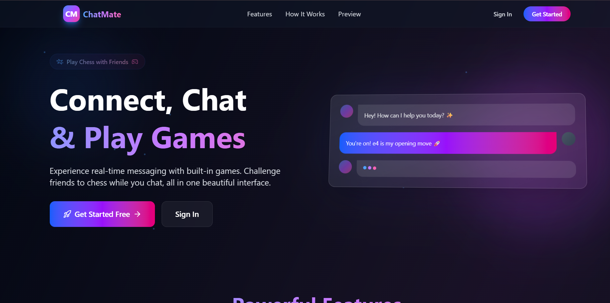

# 🐱 ChatCat



> **Modern AI-Powered Chat Application**  
> Built with React, Vite, Supabase, and Tailwind CSS.

[](https://chatcat-nu.vercel.app)

---

## 🚀 Features

- **🔐 Secure Authentication**: Includes **Google OAuth** and Email/Password login via Supabase Auth.
- **🛡️ Protected Routes**: Secure dashboard access with robust session management (PKCE flow).
- **🎨 Modern UI**: Fully responsive interface built with **Tailwind CSS** and custom animations.
- **⚡ Fast Performance**: Powered by **Vite** for lightning-fast builds and hot reloading.
- **🌑 Dark Mode**: Sleek dark-themed design with glassmorphism effects.
- **💾 Database**: Scalable backend provided by **Supabase** (PostgreSQL).

---

## 🛠️ Tech Stack

| Component | Technology |
|-----------|------------|
| **Frontend** | [React 19](https://react.dev/), [Vite](https://vitejs.dev/) |
| **Styling** | [Tailwind CSS](https://tailwindcss.com/), [Lucide React](https://lucide.dev/) |
| **Backend/Auth** | [Supabase](https://supabase.com/) |
| **Deployment** | [Vercel](https://vercel.com/) |
| **Language** | [TypeScript](https://www.typescriptlang.org/) |

---

## 📂 Project Structure

```bash
chat-app/
├── public/              # Static assets
├── src/
│   ├── components/      # Reusable UI components (Button, Input, ProtectedRoute)
│   ├── context/         # React Context (AuthContext)
│   ├── layouts/         # Page layouts (AuthLayout, MainLayout)
│   ├── pages/           # Application pages
│   │   ├── Landing.tsx  # Intro/Landing page
│   │   ├── Login.tsx    # Sign In page
│   │   ├── Signup.tsx   # Sign Up page
│   │   └── Home.tsx     # Chat Dashboard
│   ├── services/        # API services (supabaseClient)
│   ├── App.tsx          # Main routing & app logic
│   └── main.tsx         # Entry point
├── index.html           # HTML template
├── tailwind.config.js   # Tailwind configuration
└── vite.config.ts       # Vite configuration
```

---

## ⚡ Installation Guide

Follow these steps to set up the project locally:

1.  **Clone the repository**:
    ```bash
    git clone https://github.com/Vaibhav01-bit/chat-bot.git
    cd chat-bot
    ```

2.  **Install dependencies**:
    ```bash
    npm install
    # or
    yarn install
    ```

3.  **Configure Environment Variables**:
    Create a `.env` file in the root directory and add your Supabase credentials:
    ```env
    VITE_SUPABASE_URL=your_supabase_project_url
    VITE_SUPABASE_ANON_KEY=your_supabase_anon_key
    ```

4.  **Run the development server**:
    ```bash
    npm run dev
    ```

5.  **Open in Browser**:
    Visit `http://localhost:5173` to view the app.

---

## 🔐 Authentication Flow

1.  **Intro Page**: Users land on a feature-rich landing page.
2.  **Login/Signup**: Authenticate via Google OAuth or Email.
3.  **Redirect**: 
    - Supabase validates credentials.
    - App performs secure code exchange (PKCE).
    - User is redirected to `/chat`.
4.  **Dashboard**: Protected access to the chat interface.

---

## 🔮 Future Improvements

- [ ] **Real-time Messaging**: WebSocket integration for instant chat.
- [ ] **AI Integration**: Connect with OpenAI/Gemini API for smart responses.
- [ ] **User Profiles**: Custom avatars and status updates.
- [ ] **Group Chats**: Multi-user channels and rooms.

---

## 👨‍💻 Author

**Vaibhav Ingle**  
- GitHub: [@Vaibhav01-bit](https://github.com/Vaibhav01-bit)

---

*Generated for ChatCat - 2026*
